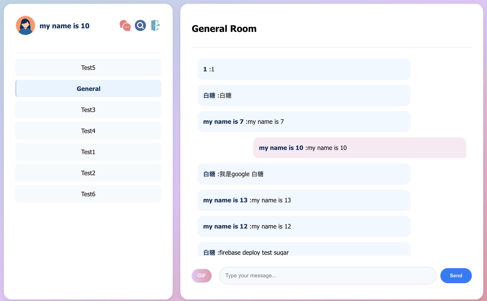

# Chat Room 
## Basic components

- **Membership Mechanism**
  - Email Sign Up ：
    如果帳號沒有Sign up 過，要先sign up，Sign up 要填寫userName/phone/address等資料，按下Sign up 會直接登入。
  - Email Sign In ：如果有註冊過則可以直接登入
  - 可點選上面Sign in / Sign up進行切換，下面按鈕字樣也會隨之改變
  - Email 格式要對，密碼要大於6碼
  
  
   

- **Host your Firebase page**
  - Done!
  

- **Database read/write**
  - Done!
  - using firestore
  

- **RWD**
  - Done!把所有物件縮小並改為豎排
  
  

- **Git**

- **Chatroom**
  - General 是所有用戶的群組
  - icon : 創建群組(粉）/ 搜尋訊息（藍）/登出（綠）
  - 左邊欄位是當前用戶所在的所有群組
  - 右邊是聊天室
  

## Advanced components
- **Using React**
    - yeap!

- **Sign Up/In with Google or other third-party accounts**
- 按下這個icon可以用google登入，但是username是email @前的字串，其他資料為unknown，之後可以在profile設定

- **Add Chrome notification**
    -  Mac的話要把右上角通知叫出來才看得到，google chrome、arc 的預設通知都是關閉要打開才看得到，記得關勿擾 

- **Use CSS animation**
    - 背景顏色漸變
    - 打字機動畫
    
    -   變顏色的"Enter Some keywords"
    

- **Deal with problems when sending code**
    - Done! 

## Bonus Components 
- **User profile**:
  - 點選左上角頭像可以進入自己帳號的profile，可以在這邊編輯userName/phone/address
  

- **Unsend message**:
  - 點選訊息，會跳出選擇匡，只能收回自己的訊息
  

- **Search for message**:
    - 按放大鏡進入搜尋頁面
  - 輸入好想搜尋的字詞後，要按serch才會開始搜尋
  - 搜尋時會有"searching..."的小動畫
    

- **Send gif from Tenor API**:
    -   按下gif按鈕進入選擇gif頁面
    -  可以搜尋並選擇想要的gif
    - gif 頁面的排版和滑動有很多很多CSS
        
        

